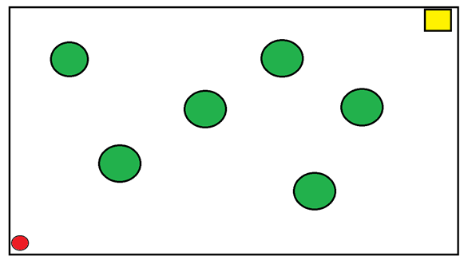
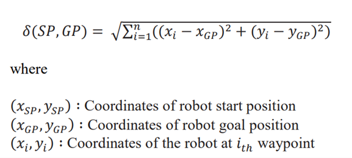
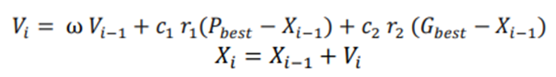
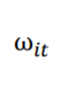
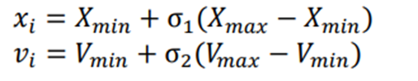
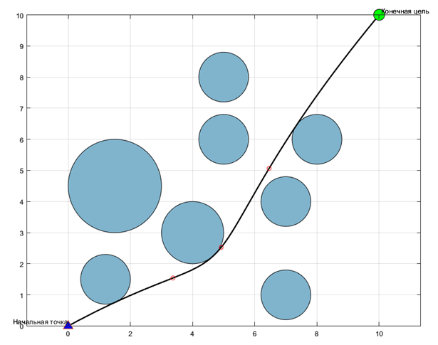
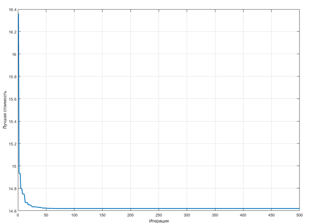

# О чем проект

## Цель проекта:

Разработка системы планирования траектории с использованием метода роя для управления мобильным роботом. 
Целью является создание эффективной и оптимальной траектории, учитывающей препятствия, чтобы мобильный робот мог безопасно и быстро перемещаться от начальной точки к целевой.

Макет сцены:

## Модель
Модель включает следующие компоненты:
Начальная и конечная точки:
Начальная точка (xs, ys): 
Конечная точка (xt, yt): 
Точки управления: Точки управления (n), которые определяют форму траектории.
Границы пространства: xmin, xmax, ymin, ymax Ограничения по x и y координатам.
Препятствия: координаты и радиусы препятствий в окружающей среде.
Количество препятствий:
Заданное количество препятствий в окружающей среде.

## Функция стоимости:

Длина Пути:
Рассчитывается расстояние между точками траектории, определенными в решении. Чем короче путь, тем лучше.
Столкновения:
Проверяется наличие пересечений траектории с препятствиями в окружающей среде. Чем меньше нарушений безопасности, тем лучше.
% Расчет общей стоимости как суммы длины пути и штрафа за нарушение
% Веса для целевой функции и штрафа за нарушение ограничений
beta = 100; 
z = sol.L * (1 + beta * sol.Violation);

## Вычсление столкновения:

% Проверка нарушений ограничений относительно препятствий
nobs = numel(xobs); % Количество препятствий
Violation = 0;
for k = 1:nobs
d = sqrt((xx - xobs(k)).^2 + (yy - yobs(k)).^2);
v = max(1 - d / robs(k), 0);
Violation = Violation + mean(v);
end

xx и yy - это координаты точки на пути xobs(k) и yobs(k) - координаты центра k-го препятствия.
robs(k) - радиус k-го препятствия.
Функция sqrt((xx - xobs(k)).^2 + (yy - yobs(k)).^2) вычисляет расстояние между точкой на пути и центром препятствия.
Затем 1 - d / robs(k) вычисляет "степень проникновения" точки внутрь препятствия. 
Затем в коде используется суммирование этих значений для всех препятствий:
## Обновления скорости

Обновление скорости и положения каждой частицы:

Инерционный вес: (вводится для сохранения некоторой инерции движения частицы.)

Положение и скорость каждой частица в рое случайным образом инициализируется:

## Графики
Лучший найденный маршрут

Динамика оптимизации по итерациям

# Заключение
Разработанный алгоритм планирования пути в среде с препятствиями на основе метода роя частиц эффективно выполняет планирование пути со сложным пространственным расположением препятствий, а также позволяет исследователю варьировать параметры роя для достижения требуемой точности и затрачиваемого времени при нахождении оптимальной траектории движения мобильного объекта
